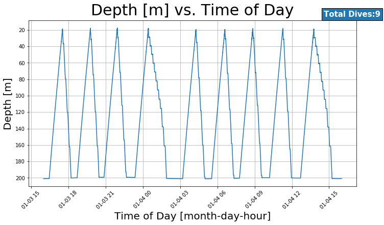
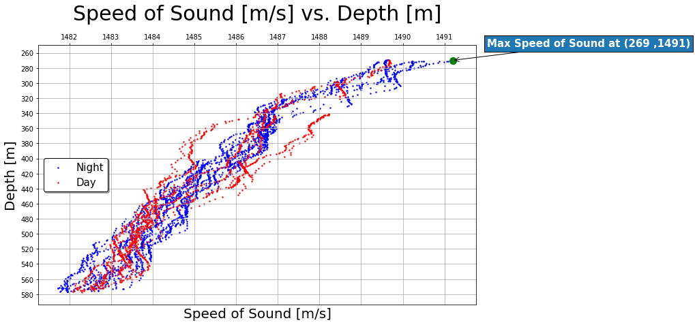
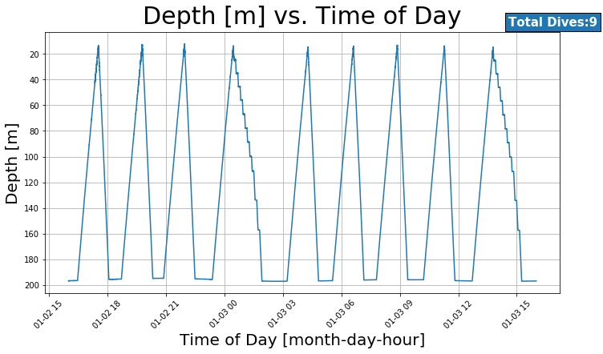
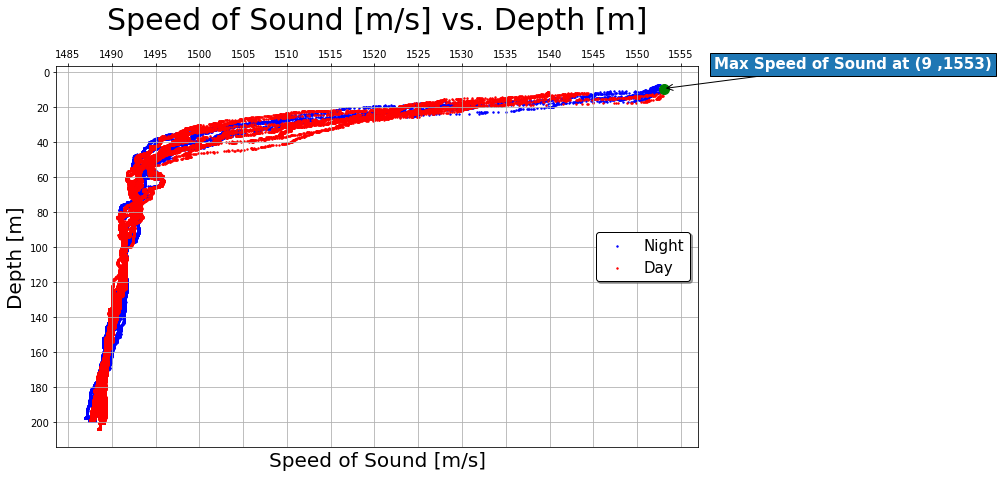
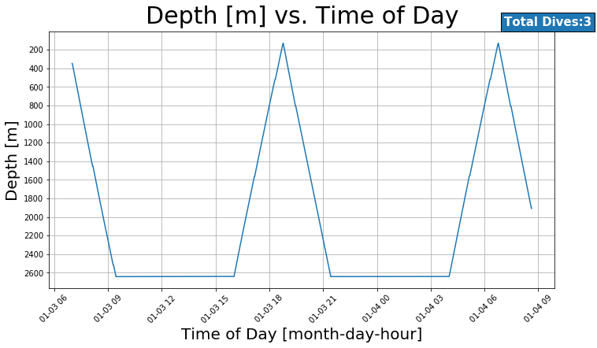
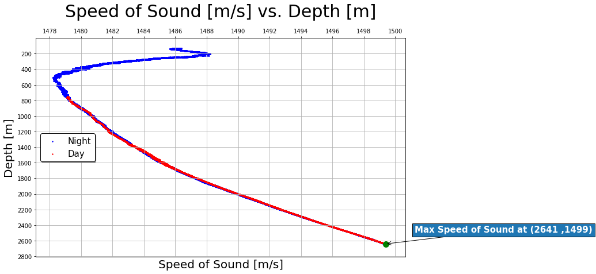

  # 
 CTD Project 
  

Josaiah Clark 
BME 450, Abadi 
1/31/20 

<h1>CODE</h1>
Colab Notebook: https://colab.research.google.com/drive/1txsKG376K3uNdF4mjwaFeekaGE1iKsit 

## Introduction
In this project, depth frequency and speed-of-sound profiles in Winter versus Summer and Day versus Night were considered for various CTD locations in the Cascadia region. Additionally, average speed-of-sound profiles were compared between locations.

<h2>1.Oregon Shelf Surface Piercing Profiler Mooring</h2>

| Winter | Summer |
| --- | --: |
| Depth versus Time |
|  | |
|Speed-of Sound Profile|
|
|
|

<h2>2.Oregon Offshore Cabled Shallow Profiler Mooring</h2>

| Winter | Summer |
| --- | --: |
| Depth versus Time |
|  | |
|Speed-of Sound Profile|
|
|
|

<h2>3.Oregon Offshore Cabled Deep Profiler Mooring</h2>
| Winter | Summer |
| --- | --: |
| Depth versus Time |
|  | |
|Speed-of Sound Profile|
|
|
|

<h2>4.Oregon Slope Base Shallow Profiler</h2>
| Winter | Summer |
| --- | --: |
| Depth versus Time |
|  | |
|Speed-of Sound Profile|
|
|
|

<h2>5.Oregon Slope Base Deep Profiler</h2>
| Winter | Summer |
| --- | --: |
| Depth versus Time |
|  | |
|Speed-of Sound Profile|
|
|
|

<h2>6.Axial Base Shallow Profiler</h2>
| Winter | Summer |
| --- | --: |
| Depth versus Time |
|  | |
|Speed-of Sound Profile|
|
|
|

<h2>7.Axial Base Deep Profiler</h2>
| Winter | Summer |
| --- | --: |
| Depth versus Time |
|  | |
|Speed-of Sound Profile|
|
|
|

<h2>Summer</h2>

<h2>2.Oregon Offshore Cabled Shallow Profiler Mooring</h2>

<h2>Winter</h2>

<h2>Summer</h2>

<h2>3.Oregon Offshore Cabled Deep Profiler Mooring</h2>

<h2>Winter</h2>

<h2>Summer</h2>

<h2>4.Oregon Slope Base Shallow Profiler</h2>

<h2>Winter</h2>

<h2>Summer</h2>

<h2>5.Oregon Slope Base Deep Profiler</h2>

<h2>Winter</h2>

<h2>Summer</h2>

<h2>6.Axial Base Shallow Profiler</h2>

<h2>Winter</h2>

<h2>Summer</h2>

<h2>7.Axial Base Deep Profiler</h2>

<h2>Winter</h2>

<h2>Summer</h2>

<h2>Winter</h2>

Answer these questions: 
a. Compare the number of dives per day of the shallow profiler vs deep profiler. 
  In general, the deeper profilers had more dives per day. The Axial Base profilers had the same number of dives per day, less than most other profilers. The Axial Base Profilers tend to travel over 2500 meters per trip, so seeing less trips per day than other profilers on these two CTD's makes sense.

b. Where is the maximum value of ssp in each season? Explain why the max ssp should be there? 
  In the winter, the max speed of sound is further from the top; this is most evident with shallow and modestly deep (less than 300m) profilers. With deep profilers like the Axial Base ones, the maximum speed of sound is as deep as the deepest sensor reading; at this point, depth becomes a more significant factor than temperature. During the summer, the max speed of sound is always at or near the water's surface; this is due to the fact that the speed of sound increases with water temperature.

c. Compare the ssp profile in day and night of all profilers, explain what you find (effect of day vs night). 
  Similar to the changing of the seasons, the speed of sound profile in daytime tends to decrease the depth of the max speed of sound. Additionally, during the daytime thermoclines tend to extend, and as night time arrives they tend to shrink. This effect is more pronounced with shallower profilers than deeper profilers, as fluctuations in temperature are larger toward the water's surface.

d. Compare the ssp profile in summer and winter of all profilers, explain what you find (effect of season). 
    The speed-of-sound profile in the Summer of all profilers shows a sharper drop in speed of sound than Winter. The ocean's thermocline in the summer must be causing a steeper temperature gradient than in Winter due to surface water heating.

e. Compare the average ssp profiles of all profilers recorded at the same day in winter and summer (effect of location). 
  The average speed-of-sound profiles for all profilers assume shapes that are fairly predictable, decreasing to a maximum speed-of-sound point until increases in depth and salinity outweigh further decreases in temperature, causing the speed of sound to increase again.
  

article .left_column{
font-size: 14px;
}
