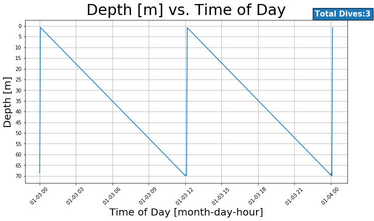
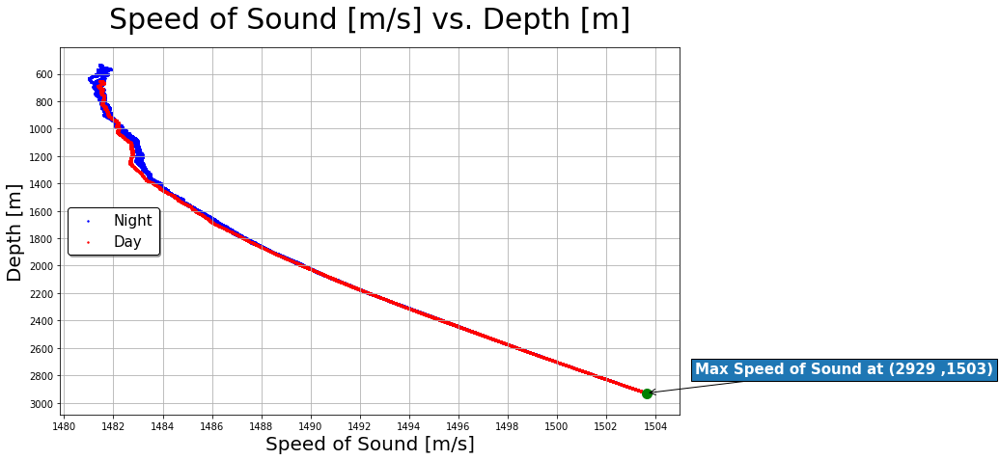
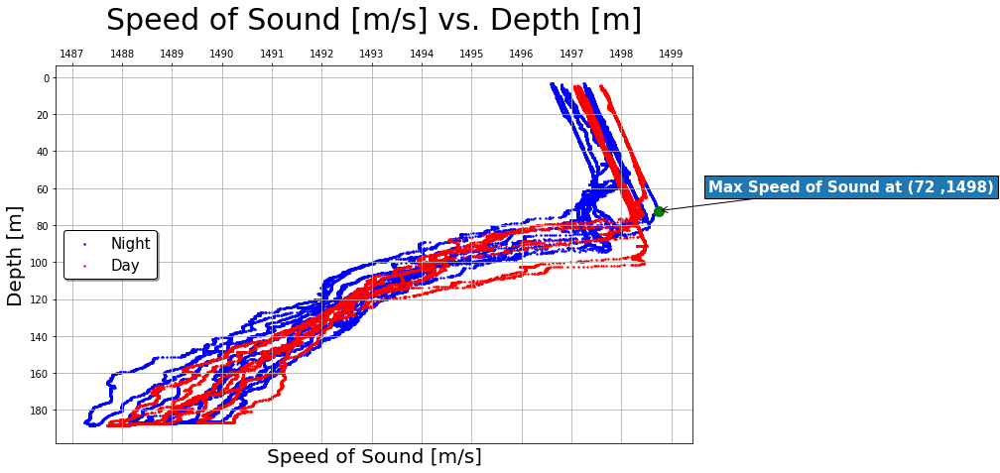
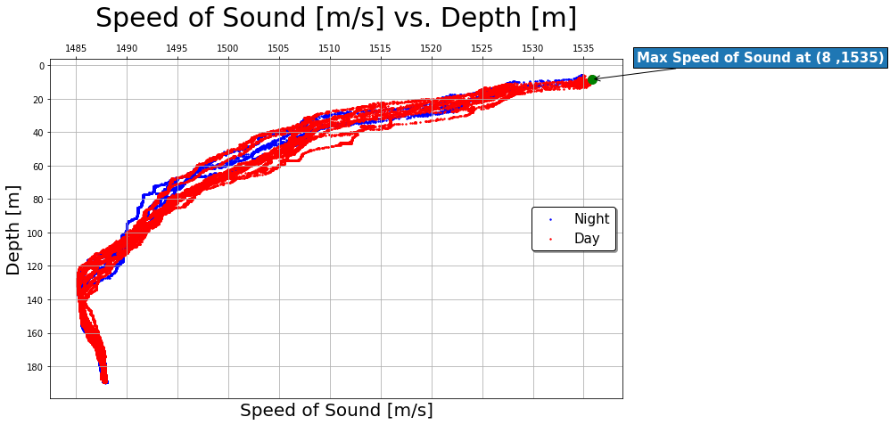
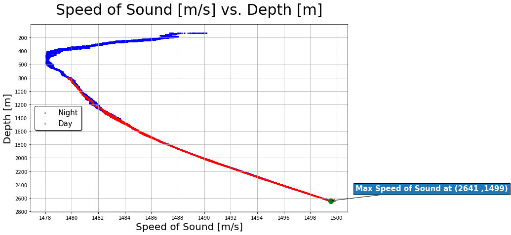

# 
    CTD Project 
  

Josaiah Clark 
BME 450, Abadi 
1/29/20 

## Introduction
In this project, Depth vs. Time and Speed of Sound vs. Depth were mapped in Winter and Summer for the following CTD locations:

<h2>1.Oregon Shelf Surface Piercing Profiler Mooring
**Winter**

**Summer**

<h2>2.Oregon Offshore Cabled Shallow Profiler Mooring<h2> 
**Winter**

**Summer**

3.Oregon Offshore Cabled Deep Profiler Mooring 
**Winter**

**Summer**

4.Oregon Slope Base Shallow Profiler 
**Winter**

**Summer**

5.Oregon Slope Base Deep Profiler 
**Winter**

**Summer**

6.Axial Base Shallow Profiler 
**Winter**

**Summer**

7.Axial Base Deep Profiler 
**Winter**

**Summer**

Answer these questions: 
a. Compare the number of dives per day of the shallow profiler vs deep profiler. 

b. Where is the maximum value of ssp in each season? Explain why the max ssp should be there? 

c. Compare the ssp profile in day and night of all profilers, explain what you find (effect of day vs night). 

d. Compare the ssp profile in summer and winter of all profilers, explain what you find (effect of season). 

e. Compare the average ssp profiles of all profilers recorded at the same day in winter and summer (effect of location). 

Colab Notebook: https://colab.research.google.com/drive/1txsKG376K3uNdF4mjwaFeekaGE1iKsit
